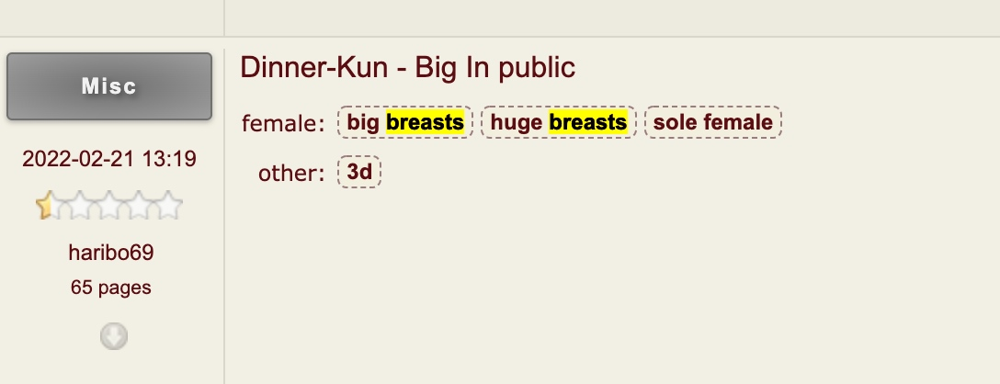

# 搜索规则

有疑问的话, 欢迎加入群组讨论 https://t.me/carbon_research

在大类上, e站的搜索分为2种

    1.对标题进行搜索

    2.对标签进行搜索

是一个基于NameSpace(命名空间) + Tags(标签)的搜索系统比如

`m:milf`

m是NameSpace, milf是Tag

## 示例一

   `f:milf`(等同于female:milf)

表示**只搜索标签**, NameSpace为f, tag为milf

如下图所示, 搜索结果有42,203个

## 示例2

`milf`

表示**同时搜索标签和标题**, 如下图所示, 搜索结果有42,543个

因为同时搜索了标题, 所以多出了下图中, 标题中有milf, 而标签中没有milf的画廊

## 示例3

搜索词应以空格分隔（逗号不能用作分隔符), **表示交集**

`f:milf m:muscle`

同时拥有f:milf和m:muscle的画廊为1658个

## 示例4

-号表示去除

`pokemon -furry`

表示同时在标题和标签下搜索pokemon, 之后再去除标题和标签中所有带furry的画廊

## 示例5

**双引号""用来表示有多个单词的tag**

`f:"big breasts" f:"sex toys" f:"double penetration"
`
如果这里写成这样 f:big breasts, 系统会把它当成2个搜索条件

f:big和breasts,

会匹配标签中的f:big和标题或者tag中带有breasts的交集(对breasts进行搜索时,会匹配f:huge breasts)

而f:"big breasts"会精确匹配, 把big breasts当成是一个tag,而不是分开的两个

## 示例6

**$表示强制结尾**

`c:sakura$(c表示character)`

使用$号结尾, 搜索结果中将不包含c:sakura kinomoto和c:sakura haruno等标签,搜索结果的标签必须为c:sakura, 不能多任何一个字符

再举一个例子
f:big$表示要搜索名字为big的标签, 但很明显,eh没有big这个标签, 所以搜索结果为空

## 示例7

通配符

***可以表示0个1个或者多个任意字符**

举例

`comic*xo*4`可以匹配 `comicYYYYYYYxoKKKKKKK4`(任意个字符)或者`comicxo4`(0个字符)

**?和_可以表示任何单一字符**

# 高级选项
1.搜索画廊名称

默认启用。搜索罗马字母和日文标题字段。

2.搜索图库标签

默认启用。仅适用于具有至少 10 mod power 的标签。

3.搜索说明(画廊描述)

搜索画廊上传者的描述文本。

4.仅显示带有种子的画廊

将排除没有种子的画廊。

5.搜索低愿力标签

需要搜索库标记。搜索 1-10 mod power 之间的标签（除了常规标签）。

6.搜索被否决的标签

e站在新上传本子的时候,每个用户可以对该画廊打标签, 如果被很多人投否定票, 就是被否定的标签

7.显示已删除的画廊

eh的画廊可以大致分为4种

1) regular: 普通画廊,可以正常被搜索到
2) private: 隐私画廊, 无法被搜索到, 只可以通过链接访问
3) deleted: 因为版权原因, 被删除的画廊
4) expunged: 不完整,缺页的画廊, 完整版在被上传之后, 该不完整画廊会被投票expunged,如果投票权重大于100, 该画廊被expunged, 无法通过正常搜索搜索到

勾选该选项,将会显示被expunged的画廊

8.最低评级

设置搜索结果的最低评分

9.页数在 x页 和 x页之间

对长度进行限制

10.禁用默认过滤器

如果勾选,会禁用自己在setting和my tags中的默认过滤器

# 文件搜索

允许用户通过上传找到包含与给定图像匹配或相似的图像的画廊。一次只能搜索 1 个文件。上传的文件不会存储在服务器上。在初始化文件搜索之后，通过比较上传文件的 SHA-1 哈希值和画廊中所有图像的数据库来搜索精确的图像匹配。单调（通常是黑白）图像不适用于相似度扫描。新创建的画廊没有实时索引他们的文件。

## 文件搜索选项
1.使用相似度扫描

默认启用。

搜索非精确匹配；更好地找到不同的分辨率、清晰度或质量。

2.仅搜索封面

只会将上传的图片与每个画廊的第一张图片进行比较。

3.显示已删除

启用搜索已删除画廊的图像。这不会启用搜索已删除、私人或已删除画廊的图像。

4.使用 URL 按Hash搜索

也可以直接搜索 SHA-1 哈希，而无需通过搜索界面实际上传图像。只需将哈希值替换为如下所示 URL 的末尾。

`https://e-hentai.org/?f_shash=Sha-1_Hash_Here
`

# 搜索限制

1.不允许仅包含排除项的搜索。

2.搜索只能每 3 秒执行一次。

3.无论使用何种选项或条件，搜索结果的上限为 100,000。

4.某些关键字被阻止并且不会产生任何结果；这是故意的。

5.最多可使用 8 个词条进行搜索；任何附加条款都将被忽略。

6.除非包含非临时命名空间，否则任何 3 个字符以下的字母数字词条（“3d”除外）都将被忽略。东亚语言（如日语）的单个字符不受此限制。

7.如果启用了标签搜索，则将忽略诸如“the”之类的常用术语，除非它们是更大术语的一部分（通过使用引号或通配符）。

8.“上传者”命名空间仅限于每次搜索一个

# 搜索小技巧

1.eh会根据Unicode进行英文单字和日文单字的匹配, 比如book和"本"

举例, 这意味着搜索“book*2004”或“book?2004”（但不是“book2004”）将返回一个英文标题为“2004 Book”和日文标题为“2004本”的画廊，即使这两个标题都不是单独的实际上匹配该搜索。使用2+个字符,会减少错误的概率

# 标题与标签匹配

搜索引擎以不同方式查找图库标题和标签的匹配项。

对于标题，引擎可能会在任何地方尝试匹配，甚至在单词中间。

搜索“berry”可能会匹配标题“Berry Blue”或“Strawberry”。

对于标签，引擎只会尝试匹配整个标签（从标签的开头）或标签中的单词（从单词的开头）。

搜索“berry”可以匹配标签“berry blue ” 但不是“strawberry”。

搜索“I * berry”或“st * berry”将匹配类似的标签：:i my me strawberry eggs.。前者匹配整个标签，后者匹配标签中的一个单词。

搜索“my*berry”不会，因为该字符串无法匹配整个标签或单个单词。
